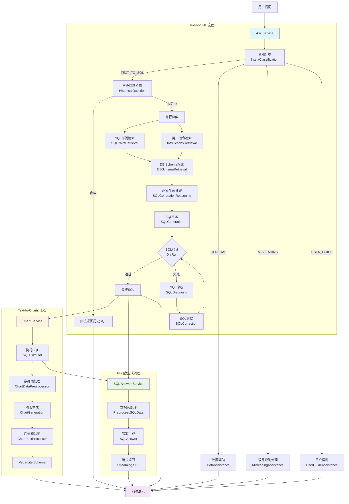
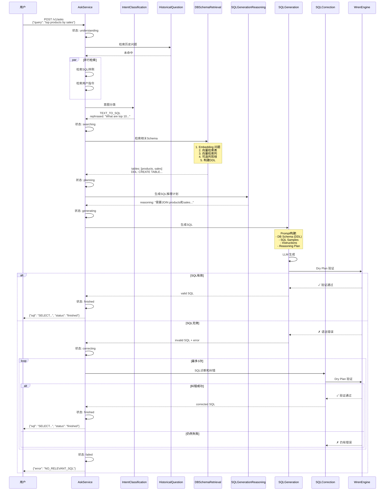
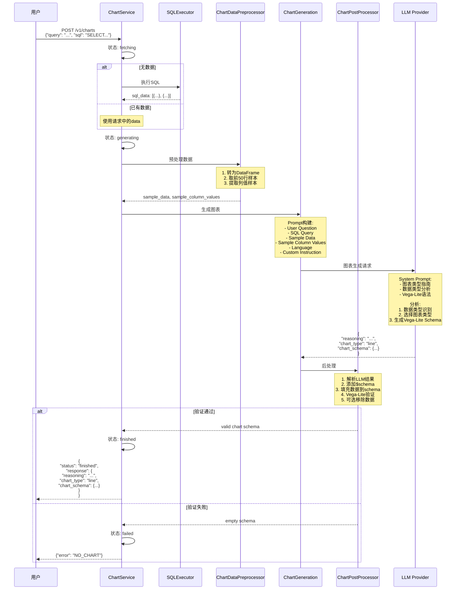
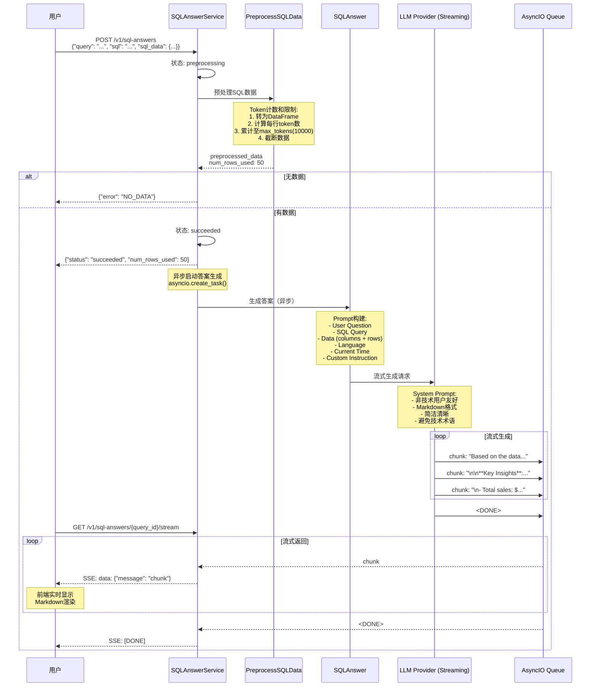
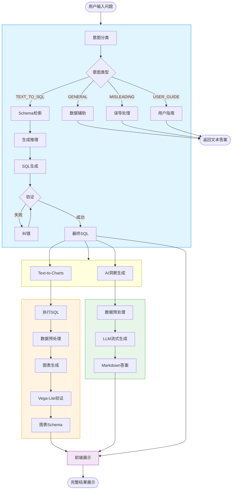

# GenBI 核心功能数据流转图

## 🎯 整体架构图



## 📋 Text-to-SQL 详细流程图



## 📊 Text-to-Charts 详细流程图



## 💡 AI 洞察生成详细流程图



## 🔄 完整集成流程（端到端）



## 🏗️ 系统架构层次图

```mermaid
graph TB
    subgraph Frontend ["前端层 (wren-ui)"]
        UI1[React组件]
        UI2[GraphQL客户端]
        UI3[SSE处理]
        UI4[Vega-Lite渲染]
    end
    
    subgraph APIGateway ["API网关层"]
        API1[REST API]
        API2[GraphQL API]
        API3[WebSocket/SSE]
    end
    
    subgraph Services ["服务层 (wren-ai-service)"]
        S1[AskService]
        S2[ChartService]
        S3[SQLAnswerService]
        S4[其他服务...]
    end
    
    subgraph Pipelines ["Pipeline层"]
        direction LR
        P1[Generation<br/>Pipelines]
        P2[Retrieval<br/>Pipelines]
        P3[Indexing<br/>Pipelines]
    end
    
    subgraph Core ["核心层"]
        C1[LLM Provider<br/>OpenAI/Anthropic/...]
        C2[Embedder Provider<br/>OpenAI/HuggingFace]
        C3[Document Store<br/>Qdrant]
        C4[Wren Engine<br/>SQL执行/验证]
    end
    
    subgraph Data ["数据层"]
        D1[向量数据库<br/>Qdrant]
        D2[关系数据库<br/>PostgreSQL]
        D3[语义层<br/>MDL]
    end
    
    Frontend --> APIGateway
    APIGateway --> Services
    Services --> Pipelines
    Pipelines --> Core
    Core --> Data
    
    style Frontend fill:#e3f2fd
    style APIGateway fill:#fff3e0
    style Services fill:#e8f5e9
    style Pipelines fill:#fce4ec
    style Core fill:#f3e5f5
    style Data fill:#e0f2f1
```



## 📊 数据流向详解

### 1. 向量检索流程

```
用户问题: "What are the top selling products?"
    ↓
[Embedder] 文本向量化
    ↓
embedding: [0.234, -0.567, 0.891, ...]  (768维向量)
    ↓
[Qdrant 向量数据库] 相似度检索
    ↓
检索结果:
├─ 表: products (相似度: 0.95)
├─ 表: sales (相似度: 0.92)
├─ 列: product_name (相似度: 0.88)
├─ 列: quantity_sold (相似度: 0.85)
└─ 指标: total_revenue (相似度: 0.83)
    ↓
[构建DDL]
    ↓
CREATE TABLE products (
  product_id INT PRIMARY KEY,
  product_name VARCHAR(255),
  category VARCHAR(100)
);

CREATE TABLE sales (
  sale_id INT PRIMARY KEY,
  product_id INT,
  quantity_sold INT,
  revenue DECIMAL(10,2)
);
```

### 2. LLM Prompt 构建流程

```
[System Prompt]
You are a Trino SQL expert...

[User Prompt]
### DATABASE SCHEMA ###
CREATE TABLE products (...)
CREATE TABLE sales (...)

### SQL SAMPLES ###
Question: Show me customer orders
SQL: SELECT * FROM orders WHERE...

### USER INSTRUCTIONS ###
1. Always use proper JOIN conditions
2. Format dates as YYYY-MM-DD

### QUESTION ###
User's Question: What are the top selling products?

### REASONING PLAN ###
1. JOIN products and sales tables
2. GROUP BY product
3. ORDER BY total quantity
4. LIMIT to top 10

Let's think step by step.
```

### 3. SQL 生成和验证流程

```
[LLM 生成]
SELECT 
  p.product_name,
  SUM(s.quantity_sold) as total_sold
FROM products p
JOIN sales s ON p.product_id = s.product_id
GROUP BY p.product_name
ORDER BY total_sold DESC
LIMIT 10
    ↓
[Wren Engine Dry Plan]
- 语法检查: ✓
- 表存在性: ✓
- 列存在性: ✓
- JOIN条件: ✓
- 类型兼容: ✓
    ↓
[返回验证结果]
status: valid
execution_plan: [...]
```

### 4. 图表生成决策树

```
[数据分析]
列1: product_name (类型: string, 类别: nominal)
列2: total_sold (类型: number, 类别: quantitative)
数据行数: 10
    ↓
[图表类型决策]
- 有1个分类变量 + 1个数值变量
- 目的: 比较不同类别的数值
- 数据行数适中 (10行)
    ↓
[选择: BAR CHART]
理由: 柱状图最适合比较不同类别的数值大小
    ↓
[生成 Vega-Lite Schema]
{
  "mark": {"type": "bar"},
  "encoding": {
    "x": {"field": "product_name", "type": "nominal"},
    "y": {"field": "total_sold", "type": "quantitative"}
  }
}
```

### 5. AI 洞察生成流程

```
[输入数据]
columns: ["product_name", "total_sold"]
data: [
  {"product_name": "Product A", "total_sold": 1500},
  {"product_name": "Product B", "total_sold": 1200},
  ...
]
    ↓
[Token预算计算]
max_tokens: 10000
当前数据tokens: 2500 ✓
    ↓
[LLM 流式生成]
chunk_1: "Based on the sales data, "
chunk_2: "here are the **top selling products**:\n\n"
chunk_3: "1. **Product A** - 1,500 units sold\n"
chunk_4: "2. **Product B** - 1,200 units sold\n"
...
chunk_n: "\n**Key Insight**: Product A dominates..."
    ↓
[流式返回]
通过 AsyncIO Queue + SSE 实时传输到前端
```

## 🎯 关键技术点

### 状态机管理
```
Ask Pipeline States:
understanding → searching → planning → generating → correcting → finished/failed/stopped

Chart Pipeline States:
fetching → generating → finished/failed/stopped

SQL Answer Pipeline States:
preprocessing → succeeded/failed
```

### 缓存策略
```python
# TTL Cache配置
TTLCache(
    maxsize=1_000_000,  # 支持100万并发请求
    ttl=120             # 2分钟过期
)
```

### 并发控制
```python
# 并行执行多个检索任务
await asyncio.gather(
    sql_pairs_retrieval(),
    instructions_retrieval(),
    sql_functions_retrieval()
)
```

### 错误重试
```python
# SQL纠错重试机制
max_retries = 3
for attempt in range(max_retries):
    if sql_valid:
        break
    sql = correct_sql(sql, error)
```

---

这些流程图清晰地展示了 GenBI 三大核心功能的完整数据流转过程，从用户输入到最终结果输出的每一个环节都有详细说明。
